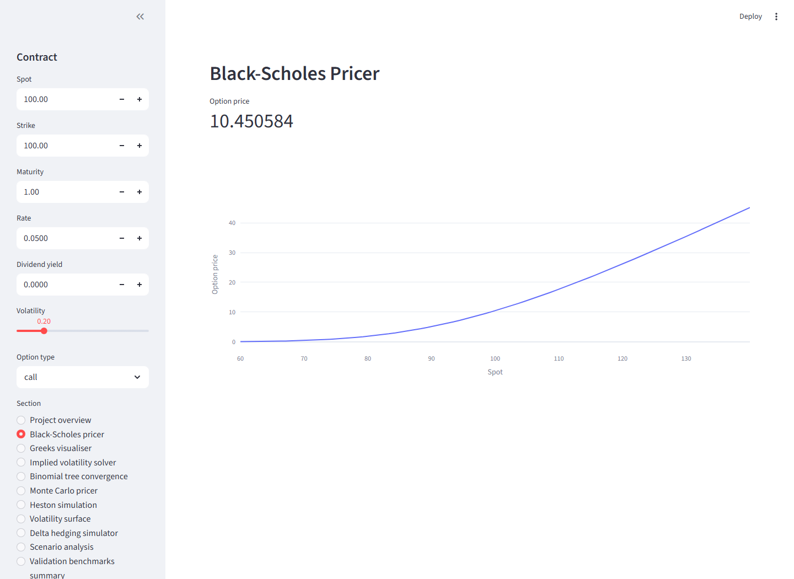
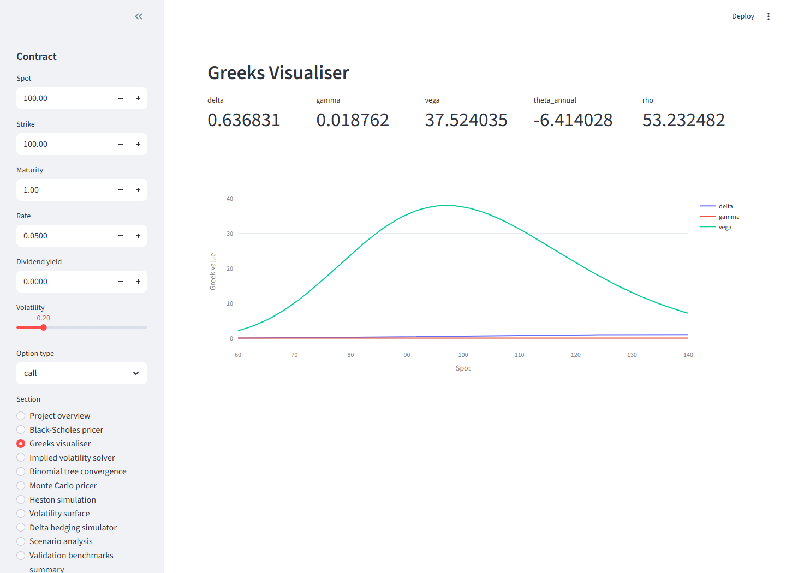
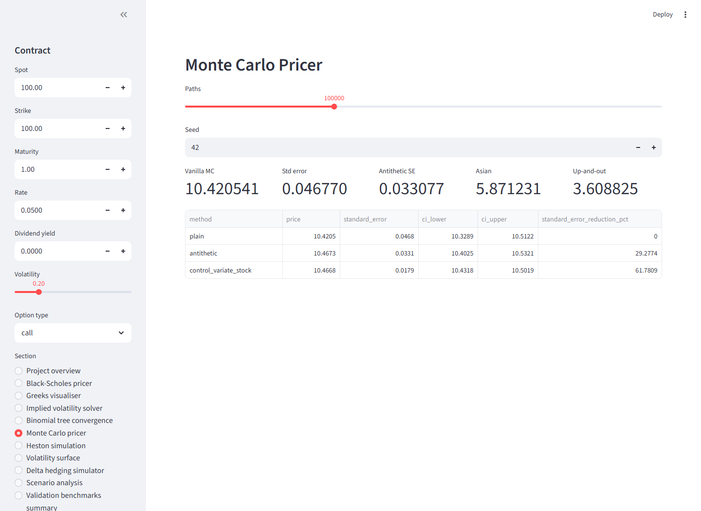
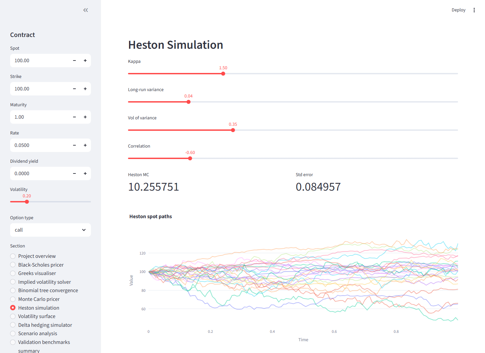
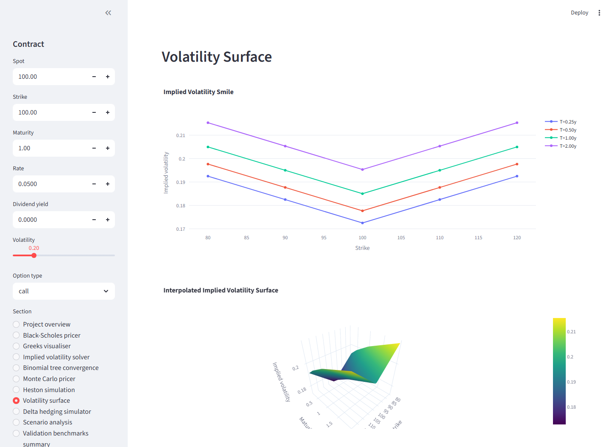
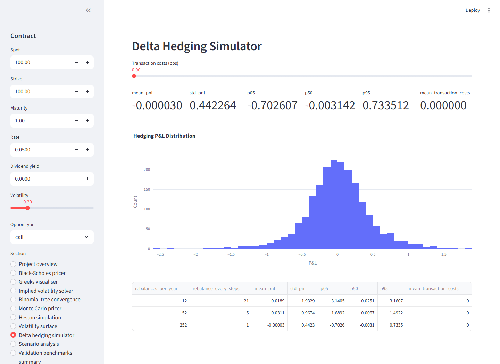

# Derivatives Pricing Engine

[](https://github.com/husaam-atq/derivatives-pricing-engine/actions/workflows/ci.yml)


A production-style Python derivatives pricing and risk analytics engine for equity options. The project is built as a reusable package with tested pricing models, executable notebooks, benchmark reports and a Streamlit dashboard.

## What This Project Demonstrates

- Analytical pricing: Black-Scholes / Black-Scholes-Merton calls and puts with dividend yield.
- Risk analytics: analytical Greeks, finite-difference Greeks, implied volatility and stress testing.
- Numerical methods: CRR binomial trees, Monte Carlo simulation and variance reduction.
- Stochastic volatility: Heston simulation, characteristic-function pricing and synthetic calibration.
- Trading workflow: volatility surface construction and delta hedging P&L simulation.
- Engineering quality: modular `src/` package, tests, CI, examples, notebooks and dashboard.

## Headline Results

Generated from live validation checks in `reports/benchmark_results.csv`.

| Benchmark | Result | Target |
| --- | ---: | --- |
| BSM call benchmark error | `1.64e-05` | `< 1e-4` |
| BSM put benchmark error | `2.60e-05` | `< 1e-4` |
| Put-call parity error | `0.0` | `< 1e-8` |
| IV recovery | Brent/Newton recovered `0.15`, `0.20`, `0.35` | Brent `< 1e-6`, Newton `< 1e-5` |
| CRR 1000-step call/put error | `~0.0020` | `< 0.02` |
| MC call error, 100k paths | `0.0068` | `< 0.15` or inside 95% CI |
| MC put error, 100k paths | `0.0740` | `< 0.15` or inside 95% CI |
| Antithetic standard error reduction | `29.16%` | lower than plain MC |
| Control variate standard error reduction | `61.75%` | lower than plain MC |
| Heston synthetic calibration RMSE | `3.12e-05` | `< 0.05` |
| Daily vs monthly hedging error std | `0.4257` vs `1.9104` | daily lower than monthly |

## Dashboard Screenshots

<table>
  <tr>
    <td width="50%"><strong>Black-Scholes Pricer</strong><br></td>
    <td width="50%"><strong>Greeks Visualiser</strong><br></td>
  </tr>
  <tr>
    <td width="50%"><strong>Monte Carlo Pricing</strong><br></td>
    <td width="50%"><strong>Heston Simulation</strong><br></td>
  </tr>
  <tr>
    <td width="50%"><strong>Volatility Surface</strong><br></td>
    <td width="50%"><strong>Delta Hedging Simulator</strong><br></td>
  </tr>
</table>

## For Recruiters And Interviewers

This is not a notebook-only demo. The pricing logic lives in a reusable Python package and is consumed by tests, examples, notebooks, reports and a dashboard.

| Role | Why It Is Relevant |
| --- | --- |
| Quant Analyst | Shows model implementation, Greeks, implied volatility, surfaces, calibration and benchmark interpretation. |
| Quant Developer | Demonstrates package design, deterministic tests, CI, typed APIs, reusable modules and Streamlit integration. |
| Equity Derivatives | Covers vanilla pricing, American exercise trees, smiles/surfaces, Heston dynamics and delta hedging. |
| Risk / Model Validation | Includes analytical benchmarks, numerical convergence, finite-difference checks, MC confidence intervals and honest limitations. |

## Architecture

```text
derivatives-pricing-engine/
|-- app/                         # Streamlit dashboard
|-- data/                        # Synthetic sample option chain
|-- docs/images/                 # Dashboard screenshots
|-- examples/                    # Executable scripts
|-- notebooks/                   # Executable analysis notebooks
|-- reports/                     # Generated benchmark CSV and Markdown report
|-- src/derivatives_engine/      # Reusable Python package
|   |-- calibration/             # Vol surface and Heston calibration
|   |-- models/                  # BSM, binomial, Monte Carlo, Heston
|   |-- risk/                    # Greeks, IV, hedging, scenarios
|   `-- utils/                   # Market data, plotting, validation
`-- tests/                       # Pytest coverage
```

## Module Map

| Module | Purpose |
| --- | --- |
| `models.black_scholes` | Analytical European call/put pricing, `d1`, `d2`, put-call parity checks. |
| `risk.greeks` | Analytical and finite-difference Delta, Gamma, Vega, Theta and Rho. |
| `risk.implied_volatility` | Brent, Newton and Newton-to-Brent fallback implied volatility solvers. |
| `models.binomial_tree` | Cox-Ross-Rubinstein European/American tree pricing and convergence tables. |
| `models.monte_carlo` | GBM path simulation, vanilla/Asian/barrier pricing, confidence intervals and variance reduction. |
| `models.heston` | Full truncation Euler simulation, Heston Monte Carlo and characteristic-function pricing. |
| `calibration.heston_calibration` | Synthetic Heston option-chain generation, least-squares calibration and fit diagnostics. |
| `calibration.volatility_surface` | Implied volatility enrichment, interpolation, smile and surface plots. |
| `risk.hedging` | Delta hedging simulator with cash account, hedge position, transaction costs and P&L distribution. |
| `risk.scenarios` | Spot, volatility, rate, time-decay and combined stress testing. |
| `utils.validation` | Live benchmark runner that writes `reports/benchmark_results.csv` and `reports/validation_report.md`. |

## Models Implemented

### Black-Scholes-Merton

European call and put prices are implemented with continuous dividend yield:

```text
C = S exp(-qT) N(d1) - K exp(-rT) N(d2)
P = K exp(-rT) N(-d2) - S exp(-qT) N(-d1)

d1 = [ln(S/K) + (r - q + 0.5 sigma^2)T] / [sigma sqrt(T)]
d2 = d1 - sigma sqrt(T)
```

### Greeks And Implied Volatility

- Analytical Delta, Gamma, Vega, Theta and Rho for calls and puts.
- Finite-difference Greeks for validation.
- Brent implied volatility solver with no-arbitrage bounds.
- Newton-Raphson solver with automatic Brent fallback.

Conventions:

- Vega is per `1.00` volatility change; `vega_per_vol_point` reports per one vol point.
- Theta is annualised calendar theta using `-dV/dT`; `daily_theta` divides by calendar days.
- Rho is per `1.00` rate change; `rho_per_bp` reports per basis point.

### Binomial Tree

The CRR tree supports European and American calls/puts, continuous dividend yield and configurable step count. The validation suite checks convergence to Black-Scholes as steps increase.

### Monte Carlo

Monte Carlo pricing supports:

- European vanilla calls and puts;
- arithmetic-average Asian calls and puts;
- up-and-out and down-and-out barrier options;
- antithetic variates;
- terminal-stock control variate;
- optional CuPy path generation when CuPy/CUDA are available.

All estimators report price, standard error and 95% confidence interval.

### Heston Stochastic Volatility

Heston paths are simulated with full truncation Euler:

```text
dS_t = (r - q) S_t dt + sqrt(v_t) S_t dW_t^S
dv_t = kappa(theta - v_t)dt + sigma_v sqrt(v_t) dW_t^v
corr(dW_t^S, dW_t^v) = rho
```

Parameters:

- `v0`: initial variance
- `kappa`: variance mean reversion speed
- `theta`: long-run variance
- `sigma_v`: volatility of variance
- `rho`: spot/variance shock correlation

The package includes Heston Monte Carlo pricing and characteristic-function pricing used for deterministic synthetic calibration.

### Heston Calibration

Calibration uses `scipy.optimize.least_squares` with bounded parameters. The workflow generates synthetic prices from known Heston parameters, calibrates back to those prices and reports true vs recovered parameters, RMSE and MAE.

Heston calibration is non-unique and sensitive to strike/maturity coverage, objective scaling and market data quality. The project reports fit quality without claiming Heston is universally superior to Black-Scholes.

### Volatility Surface And Hedging

The volatility surface module enriches option chains with implied volatility, interpolates incomplete grids and plots smiles and 3D surfaces.

The delta hedging simulator models selling or buying a European option, rebalancing the stock hedge, accruing cash, applying optional transaction costs and measuring final hedging error distribution.

## Validation

Generate benchmark artifacts:

```bash
python examples/generate_validation_report.py
```

Artifacts:

- `reports/validation_report.md`
- `reports/benchmark_results.csv`

The report includes textbook Black-Scholes checks, put-call parity, IV recovery, finite-difference Greek validation, binomial convergence, Monte Carlo confidence intervals, variance reduction, Heston sanity checks, synthetic calibration and delta hedging metrics.

## Installation

```bash
git clone https://github.com/husaam-atq/derivatives-pricing-engine.git
cd derivatives-pricing-engine
python -m venv .venv
.venv\Scripts\activate
python -m pip install --upgrade pip
python -m pip install -r requirements.txt
python -m pip install -e .
```

On macOS/Linux:

```bash
source .venv/bin/activate
```

## Run Tests And Quality Checks

```bash
python -m compileall src app examples
python -m pytest -v
python -m ruff check .
python -m black --check .
```

## Run Examples

```bash
python examples/price_option.py
python examples/calibrate_heston.py
python examples/run_delta_hedging.py
python examples/generate_validation_report.py
```

## Run Notebooks

```bash
python -m jupyter nbconvert --to notebook --execute notebooks/01_black_scholes_and_greeks.ipynb --output executed_01_black_scholes_and_greeks.ipynb
python -m jupyter nbconvert --to notebook --execute notebooks/02_monte_carlo_pricing.ipynb --output executed_02_monte_carlo_pricing.ipynb
python -m jupyter nbconvert --to notebook --execute notebooks/03_heston_model_and_calibration.ipynb --output executed_03_heston_model_and_calibration.ipynb
python -m jupyter nbconvert --to notebook --execute notebooks/04_delta_hedging_simulation.ipynb --output executed_04_delta_hedging_simulation.ipynb
```

Executed notebooks are ignored by git.

## Run Dashboard

```bash
streamlit run app/streamlit_app.py
```

Dashboard sections:

- project overview and benchmark summary;
- Black-Scholes pricer;
- Greeks visualiser;
- implied volatility solver;
- binomial convergence;
- Monte Carlo pricer;
- Heston simulation;
- volatility surface;
- delta hedging simulator;
- scenario analysis.

## Example Usage

```python
from derivatives_engine.models.black_scholes import call_price
from derivatives_engine.risk.greeks import greek_table
from derivatives_engine.risk.implied_volatility import implied_volatility

S, K, T, r, q, sigma = 100, 100, 1, 0.05, 0.0, 0.20

call = call_price(S, K, T, r, q, sigma)
greeks = greek_table(S, K, T, r, q, sigma, "call")
iv = implied_volatility(call, S, K, T, r, q, "call", method="auto")

print(call)
print(greeks)
print(iv.implied_volatility)
```

## Results Interpretation

The project validates analytical model outputs against known benchmarks and numerical estimates against statistical or convergence targets. Monte Carlo outputs include confidence intervals. Heston calibration is demonstrated on synthetic data so the true parameters are known; this is workflow validation, not a live-market claim.

## Limitations

- Sample option data is synthetic and not a live market feed.
- Black-Scholes assumes lognormal dynamics and constant volatility.
- Binomial trees become slower at very high step counts.
- Monte Carlo estimates retain sampling error even with deterministic seeds.
- Heston Monte Carlo uses full truncation Euler and may have discretisation bias.
- Heston calibration can be non-unique and unstable with sparse or noisy chains.
- Transaction cost and liquidity modelling in hedging is intentionally simplified.
- The validation report is a benchmark suite, not a formal model approval document.

## Future Improvements

- Add local volatility and Dupire surface workflows.
- Add stochastic rates or yield-curve bootstrapping.
- Add quasi-Monte Carlo Sobol paths.
- Add Longstaff-Schwartz American Monte Carlo.
- Add model-risk comparison reports across BSM, local volatility and Heston.
- Add optional real option-chain ingestion behind a data adapter.
- Add GPU kernels for larger path-dependent books.

## License

This project is released under the MIT License. See `LICENSE` for details.

- How hedge frequency, transaction costs and model assumptions interact.
- Why validation reports should show actual benchmark outcomes rather than claims.
